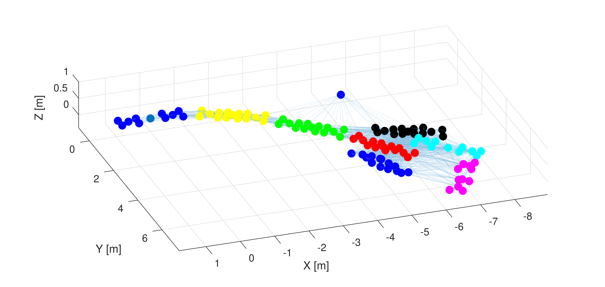

# Introduction

[](https://arxiv.org/abs/2210.09114) [](./LICENSE)

The INSANE data set is a multi-sensor cross-domain UAV data set (18 sensors) with accurate and absolute 6 DoF ground truth. The scenarios include indoor flights in a controlled environment with motion capture ground truth, outdoor-to-indoor transition flights with continuous ground truth, and extensive coverage of Mars analog data with the same vehicle. Mars analog data includes segments with various ground structures, cliff flight over, and cliff-wall traversing trajectories for mapping.

This data set is ideal for testing novel algorithms with real-world sensor data and corresponding effects such as sensor degradation. Dedicated raw data for customized sensor calibration routines and vibration data for vehicle integrity tests are provided.

**Preprint** available on [ArXiv](https://arxiv.org/abs/2210.09114)

**Data set** available on our [University Webpage](https://www.aau.at/en/smart-systems-technologies/control-of-networked-systems/datasets/insane-dataset/)

**Data set Features:**

- 6 DoF absolute ground~truth with centimeter and sub-degree accuracy 1-sigma for outdoor data sets.
- Indoor trajectories with motion capture ground truth (6 DoF millimeter and sub-degree accuracy) for the initial proof of algorithms.
- Outdoor to indoor transition trajectories with continuous absolute ground truth.
- Trajectories in a Mars analog desert environment for Mars-Helicopter analog setups, including various ground structures, cliff flight over, and cliff-wall traversing trajectories for mapping.
- Vehicle and sensor integrity, including intrinsic information such as static IMU data and RPM-correlated vibration data.
- Real-world sensor effects and degradation posed by individual scenarios.
- Initialization sequences for VIO algorithms.
- Inter-sensor calibrations in pre-calculated form and raw calibration data sequences for custom calibration routines.

The data which you can download from our website is ready to use. However, if you want to customize individual components, then all the necessary steps are described below.

**In the following, we provide scripts and their description for:**

- Sensor calibration
- Data export of the original ROS bag files
- Ground-truth generation and transition segment alignment
- and sensor CSV data to ROS bag exports

# Setup and Dependencies

Simply clone the repository and initialize the submodules recursively:

```sh
$ git clone --recurse-submodules https://github.com/aau-cns/insane_dataset_tools.git
```

The majority of the scripts are Matlab files and do not require external dependencies. A few post-processing scripts are written in Python and require additional packages and a dedicated catkin workspace for custom ROS messages.

## System Dependencies

Dependencies can be installed as follows:

```sh
$ apt-get install python3 python3-pip python3-catkin-tools opencv-contrib-python \
  ros-noetic-tf ros-noetic-cv-bridge ros-noetic-image-transport
$ pip3 install -U rospkg numpy tqdm scipy py3rosmsgs pycryptodomex
```

If you want to use a docker container, please also install the following dependencies for CV2:

```sh
$ apt-get install ffmpeg libsm6 libxext6
```

## ROS Dependencies

The data set uses two non-standard ROS messages `MotorSpeed.msg` and `TagDistance.msg`. Both message definitions are located in `catkin_ws/src/insane_msgs`. These messages have to be build for the export script and further usage.

```sh
$ cd catkin_ws
$ catkin init
$ catkin build fiducial_msgs insane_msgs
$ source ./devel/setup.bash
```

### Additional steps for non-Python 3 ROS installs (<Noetic)

If you are using a ROS version below Noetic, then the following steps are required to build **cv bridge** module against Python3

Create a dedicated catkin workspace:

```sh
$ mkdir -p ~/cvbridge_build_ws/src && cd ~/cvbridge_build_ws/src && \
  git clone -b noetic https://github.com/ros-perception/vision_opencv.git
```

Adapt the following lines in the `CMakeLists.txt` of the `ros-perception/vision_opencv` package:

```cmake
# modification at Line 11, changing:
find_package(Boost REQUIRED python37)
# to
find_package(Boost REQUIRED python-py35)
```

Compile against the Python 3 library:

```sh
$ catkin config -DPYTHON_EXECUTABLE=/usr/bin/python3 -DPYTHON_INCLUDE_DIR=/usr/include/python3.5m -DPYTHON_LIBRARY=/usr/lib/x86_64-linux-gnu/libpython3.5m.so
$ catkin build
$ source ~/cvbridge_build_ws/devel/setup.bash
```

# Export CSV and PNG to ROS Bag

If you downloaded the exported CSV and PNG files from our website and would like to use the data as a rosbag file, then you can use the following python script `post_scripts/csv2bag.py`. This requires the installation of dependencies and custom ros messages as described [here](#setup-and-dependencies).

Run the script inside a folder that only contains the data for one dataset e.g., as shown below:

```sh
mars_4
├── mars_4_sensors
├── mars_4_nav_cam
└── mars_4_stereo_cam
```

The script will scan the directory for the expected CSV files and generate a bagfile `insane_dataset.bag`.

# Dataset Post-Processing

Please keep in mind that all sensor data and ground truth information is pre-generated if you download the data packages from our website. The following steps outline the data post-processing steps if originally recorded ROS bags are used. This could be desired if you want to incorporate your own calibration routine or refine individual elements. The general procedure for exporting the data from original ROS bag recordings to CSV files for sensor, ground truth data, and individually exported PNG images is as follows:

1. Perform your own sensor calibration if required, e.g., the [Magnetometer Calibration](#magnetometer-imu-calibration) or [Marker Field Calibration](#marker-field-calibration)
2. Extract the text-based sensor information `data_extraction/extract_data.m` described [here](#dataset-extraction-from-raw-ros-bag-data)
3. Run the ground truth generation script `data_extraction/gps_mag_orientation.m` described [here](#ground-truth-generation)
4. Transition trajectory generation (additional steps) [here](#transition-trajectory-generation)
5. Export the navigation and stereo camera images `post_scripts/export_ids_img.py` and `post_scripts/export_realsense_img.py` described [here](#image-export-bag-to-png)

## General Nomenclature

The translation  defines frame  with respect to frame  expressed in frame . The translation is expressed in frame  if the subscript  is not defined. The quaternion  describes the rotation of frame  with respect to frame . }\equiv\text{\textbf{R}}_{\text{\textbf{AB}}}) denotes the conversion of quaternion  to its corresponding rotation matrix. Please note that this framework uses the Hamilton notation for the Quaternion representation.

```matlab
% Variable names:
% q_A_B rotation of frame B expressed in frame A
% p_A_B_in_X translation from A to B expressed in frame X.
% X is dropped if X = A, thus p_A_B_in_A == p_A_B.
% Example: p_A_B_in_C = R(q_C_A) * p_A_B_in_A
```

## Dataset Extraction from Raw ROS Bag Data

- Open the Matlab script `data_extraction/extract_data.m`
- Change `data_path = "/tmp"` to the desired directory e.g. `"mars_4"`
- Each data set provides a `settings.yaml` file with individual import information. This can be modified if needed. Most settings concern the cropping of individual sensor data streams. Another important element is the GNSS reference for the ENU (XYZ) conversion options are:
  `{klu = "Klagenfurt data", negev = "mars analog data", klu_ma = "klagenfurt model airport"}`
- Default file name tokens are set for the INSANE dataset structure in which sensor bags are recorded in categories (text-based sensors, computation modules, and vision sensors). Choose `insane_file_structure=true` to follow this structure or `insane_file_structure=false` to search for any bag files in the given directory.
- Run the script to read the data and export individual CSV files for the sensors and export a Matlab workspace to `<data_path>/export`
- Images are not exported during this step. Refer to [this section](#image-export-bag-to-png) for image export.

## Ground Truth Generation

You can generate the ground truth and synchronize data streams after the data is extracted as described in [Dataset Extraction](#dataset-extraction-from-raw-ros-bag-data). For more information about the ground truth generation method, please refer to the [paper](https://arxiv.org/abs/2210.09114).

- Open the Matlab script `data_extraction/gps_mag_orientation.m`
  - Change `data_path = "/tmp"` to the desired directory
  - Change `sensor_calib_data_path = /tmp/sensor_calibration.m` to the desired file
- Open Matlab Script `sensor_calibration.m`
  - Change `use_klu_incl` to false or true depending on the location
- Run the script `data_extraction/gps_mag_orientation.m`
  - Observe the time synchronization and alignment plots and change `t_crop_rtk` ant `t_crop_mag` if needed
- CSV exports and a Matlab workspace will be exported to the `data_path/export/`

## Image Export Bag to PNG

Original data was stored in dedicated bagfiles. The following scripts can be used to export the image data streams from the navigation and stereo camera. The scripts will export images as PNGs along with a CSV file that associates timestamps to each image. This requires the installation of dependencies as described [here](#setup-and-dependencies).

- For a single image stream: `post_scripts/export_nav_img.py`
- For a stereo image stream:`post_scripts/export_stereo_img.py`

**Example**, setting the data path: `export_nav_img.py ./mars_4_nav_cam/*.bag`

Details on topic and folder names can be set in the scripts:

```Python
# Parameter and Options
raw_img_export_dir = 'export/nav_img/'
time_info_filename = 'export/time_info.yaml'
raw_img_info_filename = 'export/img_ids_timestamps.csv'
in_cam_topic_name = '/mission_cam/image_raw'
```

## Transition Trajectory Generation

The transition trajectory refers to the outdoor area close to the building entrance where the GNSS information is not reliable, and no motion capture measurements are available. In this area, pose informations are determined by the fiducial marker field. This requires the installation of dependencies as described [here](#setup-and-dependencies).

In order to generate a trajectory from the fiducial marker field the following steps need to be performed and are described in the subsections below:

1. Generate a calibration of the marker field from a dedicated recording session
   1. Export marker data from a calibration bagfile -> [Marker Pose Extraction](#marker-pose-extraction-with-image-undistortion)
   2. Run the marker field calibration routine -> [Marker Field Calibration](#marker-field-calibration)
2. Generate a marker-based trajectory for an individual flight
   1. Export marker data from a flight bagfile -> [Marker Pose Extraction](#marker-pose-extraction-with-image-undistortion)
   2. Run the trajectory from marker data routine -> [Marker Based Trajectory](#marker-field-based-trajectory)
3. Align the GNSS/mag based, marker-based, and motion-capture based trajectories -> [Transition Trajectory Alignment](#transition-trajectory-alignment)

### Marker Pose Extraction (with Image Undistortion)

For extracting marker readings from multiple bagfiles, run the following Python script:

```sh
$ ./post_scripts/export_tag_data.py *.bag tag_detections.bag
```

The script will read multiple bagfiles, undistort the images based on the pinhole-radtan calibration defined in the script (this will be fed externally soon), and exports transformations based on Aruco Marker to a separate output bagfile. Depending on the settings below, the script will:

- Export the undistorted images to an output bagfile (can be deactivated if not needed)
- Apply an optional Black/White filter to the images before marker detection (for debugging)
- Detect marker and determine the camera pose w.r.t. the marker (using the marker information in `tag_info.yaml`)
- Write undistorted images with marker detection indicators and Black/White images to a bagfile for post-verification (separate, thus easy to delete after verification)

```Python
# Parameter and Options
tag_info_yaml_file = './tag_info.yaml'
in_cam_topic_name = '/mission_cam/image_raw'
out_cam_undist_topic_name = '/mission_cam/image_undistort'
out_marker_tf_topic_name = '/marker_detections'
out_marker_img_topic_name = '/mission_cam/image_marker'
out_marker_bw_image_topic_name = '/mission_cam/image_marker_bw'
out_marker_img_append_name = '_marker_img'

crop_image_to_roi = True  # Limit the undistorted output image to a region of interest / valid pixel
write_undistort_images = False
detect_tags = True
write_tag_images = True
write_marker_pose = True

pre_apply_bw_filter = False
bw_filter_thrs = 75
write_bw_images = False
```

Marker poses are exported to the `/mission_cam/image_marker` ROS topic. Verify the marker detection overlay by visually analyzing this topic. If the detections are incorrect, refer to [Aruco Marker Parameter Adaptation](#aruco-marker-parameter-adaptation) below for tips on parameter adjustments. This bag file can be deleted after.

#### Aruco Marker Parameter Adaptation

Useful information for possible errors with bigger markers can be found here:

- https://github.com/opencv/opencv_contrib/issues/2811
- https://docs.opencv.org/master/d5/dae/tutorial_aruco_detection.html
- https://docs.opencv.org/master/d7/d4d/tutorial_py_thresholding.html

However, issues in the past were correlated to the adaptive thresholding and are due to the fact that the following parameters are not scaled relative to the image resolution:

```Python
# Inside the export_tag_data.py script
aruco_params.adaptiveThreshWinSizeMin = 141  # default 3
aruco_params.adaptiveThreshWinSizeMax = 251  # default 23
aruco_params.adaptiveThreshWinSizeStep = 20  # default 10
aruco_params.adaptiveThreshConstant = 4      # default 7
```

The default parameters seem to work well with VGA resolution but not with 3 mega-pixel images. In short, to use the marker detection on higher-resolution images, the threshold window sizes need to be significantly increased, as done in the code snippet above.

Unfortunately, the marker detection function does not provide the corresponding threshold images for debugging purposes. Thus, the `export_tag_data.py` provides the option to export separately generated threshold images with the `aruco_params.adaptiveThreshWinSizeMin` value as the threshold.

```python
export_tag_thrs_images = True  # Export threshold images to export dir for debugging
export_tag_detect_images = True  # Export images with tag detection to export dir for debugging
```

### Marker Field Calibration

Scripts are located in `fiducial_marker/tag_calibration/`.

1. You will need a [Marker Pose Export](#marker-pose-extraction-with-image-undistortion) of the calibration sequence to generate a marker calibration
2. Run the `calibrate_tags_from_bag.m` Matlab script to calibrate and reference all markers to a common reference frame (main marker). This script exports a `tag_calibration.mat` file with the corresponding calibration and shows the calibrations in a 3D plot (shown below) for possible sanity checks. Color coding corresponds to the marker of the same marker board.



### Marker Field based Trajectory

Scripts are located in `fiducial_marker/tag_evaluation/`.

1. You will need a [Marker Field Calibration](#marker-field-calibration) and a [Marker Pose Export](#marker-pose-extraction-with-image-undistortion) of the flight data to generate a marker-based trajectory
2. Use the `tag_trajectory_from_bag.m` Matlab script to generate camera poses w.r.t. a main tag for the exported data. The script will store the result in a Matlab workspace file `tag_trajectory.mat`

### Transition Trajectory Alignment

The transition trajectories consist of three segments, the RTK GNSS/Magnetometer segment, the marker-based segment, and the motion capture segment. While all segments provide absolute pose information, the reference frames are not expressed in the same reference frame. The following steps describe how to align these segments and export a ground truth CSV file.

Open script `data_extraction/data_sitching.m` and set the following data paths:

```matlab
%% Set all data paths
data_path="/tmp/mars_4";
tag_calib_data_path = "/tmp/tag_calibration/export/tag_calibration.mat";
sensor_calib_data_path = "/tmp/matlab/sensor_calibration.mat";
```

Run the script, and the following CSV files with the aligned data path will be written:

- `transition_gt_in_moap.csv` - Marker-based vehicle poses are expressed in the motion capture reference frame
- `transition_gt_in_gps.csv` - Marker-based vehicle poses are expressed in the GNSS reference frame

The data is also stored in a Matlab workspace file `transition_gt.mat`

# Additional Calibrations

## Magnetometer IMU Calibration

Files are located in `calibration/mag/`

Requirements: Intrinsic magnetometer calibration requires constant rotational movement in all possible directions. Extrinsic calibration requires IMU and magnetometer measurements in different steady orientations.

1. Extract magnetic sensor data with the `data_extraction/extract_data.m` script

2. Run the intrinsic calibration first `mag_intrinsic_calibration.m` - this will be used to calculate corrected magnetometer measurements for the extrinsic calibration

3. Run the extrinsic calibration script `mag_extrinsic_calibration.m`

4. A number of plots for the individual static recordings will open and allow you to select a data segment for the steady orientation

5. Click into the plot to select the beginning and the end of the data segment (as described in the script and shown below). Close the plot and select the next data segment.

6. Run `mag_write_yaml.m` to export the result to a YAML file with all calibration components

**Selection for the extrinsic calibration:**


**Final result of the intrinsic calibration:**


# Contact

For further information, please contact [Christian Brommer](mailto:christian.brommer@aau.at)

# License

This software is made available to the public to use (_source-available_), licensed under the terms of the BSD-2-Clause-License with no commercial use allowed, the full terms of which are made available in the [LICENSE](./LICENSE) file. No license in patents is granted.

## Usage for academic purposes

If you use this software in an academic research setting, please cite the corresponding paper and consult the [LICENSE](./LICENSE) file for a detailed explanation.

```latex
@article{brommer_insane_2022,
	title     = {{INSANE}: Cross-Domain {UAV} Data Sets with Increased Number of Sensors for developing
	             Advanced and Novel Estimators},
	author    = {Brommer, Christian and Fornasier, Alessandro and Scheiber, Martin and 
	             Delaune, Jeff and Brockers, Roland and Steinbrener, Jan and Weiss, Stephan},
	year      = 2022,
	month     = oct,
	publisher = {arXiv},
	doi       = {10.48550/arXiv.2210.09114},
	url       = {http://arxiv.org/abs/2210.09114},
	note      = {arXiv:2210.09114 [cs]},
	keywords  = {Computer Science - Robotics}
}
```
